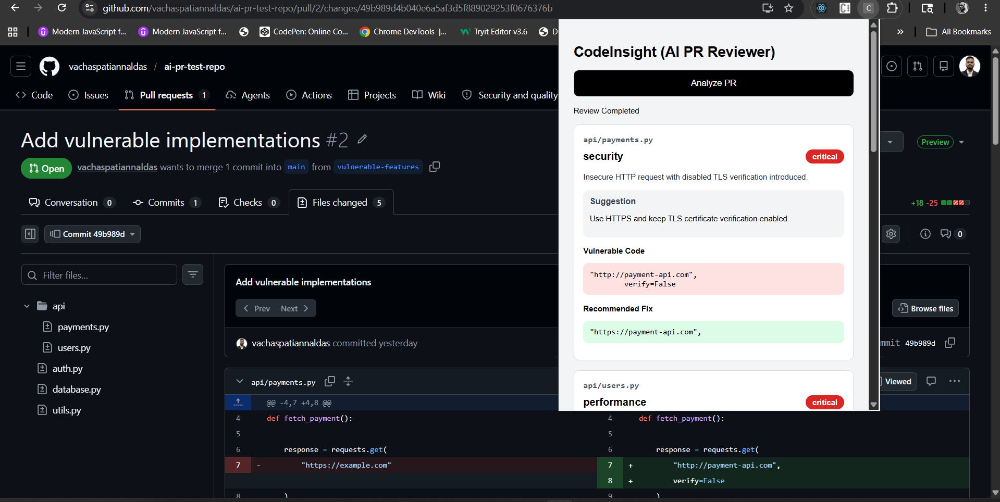
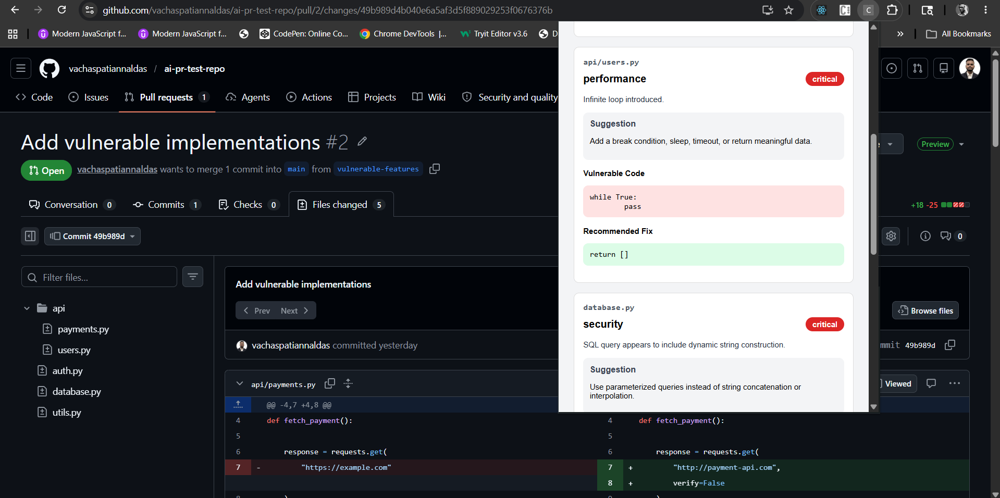
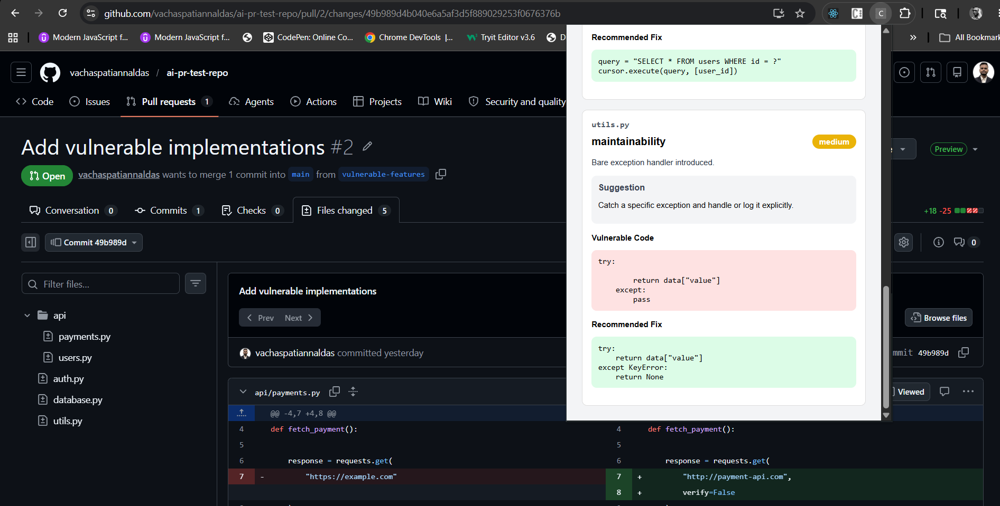
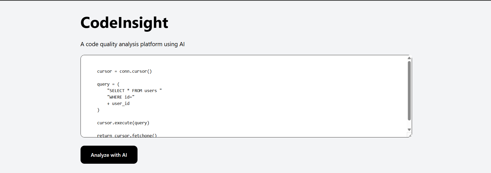
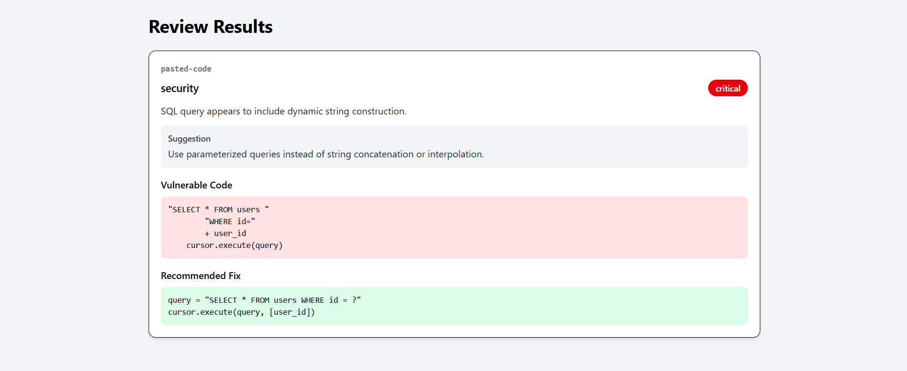

# CodeInsight - AI PR Reviewer

CodeInsight is an AI-powered pull request review platform. It reviews GitHub PR diffs and pasted code snippets, detects potential security, performance, code quality, and maintainability issues, and returns structured review cards with file names, vulnerable code, suggestions, and recommended fixes.

The project includes a React frontend, Django REST backend, Celery worker, Redis queue, PostgreSQL database, Ollama-powered local LLM review engine, and a Chrome Extension for reviewing GitHub pull requests directly from the browser.

---

## Features

- Review GitHub pull requests from a Chrome Extension
- Review pasted code or git diffs from the React frontend
- Async review processing with Celery and Redis
- Local AI review generation using Ollama and DeepSeek Coder
- Structured JSON review output
- Backend validation to reject hallucinated AI findings that do not match changed code
- Generic fallback checks for common security and maintainability issues
- Multi-file PR result cards with file name, severity, category, vulnerable code, and recommended fix
- Dockerized full-stack setup

---

## Tech Stack

### Backend

- Django
- Django REST Framework
- Celery
- Redis
- PostgreSQL

### Frontend

- React
- Redux Toolkit
- Vite
- Tailwind CSS

### AI

- Ollama
- DeepSeek Coder

### Extension

- Chrome Extension Manifest V3

### DevOps

- Docker
- Docker Compose

---

## Architecture

```text
GitHub PR Page / React Frontend
            |
            v
Chrome Extension or Web UI
            |
            v
Django REST API
            |
            v
PostgreSQL review record
            |
            v
Celery worker + Redis queue
            |
            v
Ollama / DeepSeek Coder
            |
            v
Validation + fallback checks
            |
            v
Structured review results
```

---

## Review Flow

1. The user opens a GitHub pull request and clicks **Analyze PR** in the Chrome Extension.
2. The extension fetches the PR `.diff` file from GitHub.
3. The backend stores the review request and queues a Celery task.
4. The Celery worker sends the diff to Ollama for AI review.
5. The backend validates AI findings against actual added lines in the diff.
6. Generic fallback checks add common findings if the AI misses them.
7. The frontend or extension polls the backend and displays review cards.

---

## Example Findings

CodeInsight can detect and explain issues such as:

- SQL query string construction
- Hardcoded secrets
- Insecure HTTP calls
- Disabled TLS certificate verification
- Infinite loops
- Bare exception handlers
- Potential command execution risks
- Sensitive data logging
- Weak password hashing patterns

---

## Screenshots

Add project screenshots below.

### Chrome Extension PR Review







### React Frontend Review





---

## Prerequisites

- Docker Desktop
- Node.js, only if running the frontend outside Docker
- Chrome or Chromium-based browser
- Ollama installed on the host machine

Install Ollama:

```text
https://ollama.com
```

Pull the model:

```bash
ollama pull deepseek-coder
```

Start Ollama:

```bash
ollama serve
```

The backend connects to Ollama at:

```text
http://host.docker.internal:11434/api/generate
```

---

## Environment Variables

Create this file:

```text
backend/.env
```

Example:

```env
DEBUG=True
SECRET_KEY=your-secret-key

DB_NAME=pr_reviewer_db
DB_USER=postgres
DB_PASSWORD=postgres
DB_HOST=postgres
DB_PORT=5432

REDIS_URL=redis://redis:6379/0
OLLAMA_URL=http://host.docker.internal:11434/api/generate
```

---

## Run With Docker

Start the full stack:

```bash
docker compose up --build
```

The backend automatically runs Django migrations before starting.

Open:

```text
Frontend: http://localhost:5173
Backend:  http://localhost:8000
```

Stop containers:

```bash
docker compose down
```

PostgreSQL uses a named Docker volume, so data is preserved across normal restarts. If you run `docker compose down -v`, the database volume is deleted and recreated on the next startup.

---

## Chrome Extension Setup

1. Open Chrome and go to:

```text
chrome://extensions
```

2. Enable **Developer mode**.
3. Click **Load unpacked**.
4. Select the project folder:

```text
extension/
```

5. Open a GitHub pull request page.
6. Click the CodeInsight extension.
7. Click **Analyze PR**.

---

## Frontend Code Review

The React frontend can be used for quick testing.

Open:

```text
http://localhost:5173
```

Paste either:

- a full git diff, or
- a raw code snippet

Then click **Analyze PR**.

---

## API Endpoints

Health check:

```http
GET /api/health/
```

Create review:

```http
POST /api/review/
```

Body:

```json
{
  "repository_name": "owner/repo",
  "pr_number": 1,
  "diff": "git diff content or pasted code"
}
```

Fetch review:

```http
GET /api/review/<review_id>/
```

---

## Project Structure

```text
ai-pr-reviewer/
  backend/
    config/
    reviews/
    services/
  frontend/
    src/
  extension/
    manifest.json
    popup.html
    popup.js
    content.js
  docker-compose.yml
  README.md
```

---

## Notes

This project currently uses Ollama with the DeepSeek Coder model for AI-based code analysis.

The platform works well for common code quality and security issues, but AI responses may sometimes be inconsistent or incomplete depending on the code complexity and model limitations.

To improve reliability, the backend includes JSON cleaning, validation, and fallback handling before displaying results to users.
<<<<<<< HEAD

# License

MIT License
=======
>>>>>>> 638ac20bec834a1972353eb3ecb352772a2b4dd4
